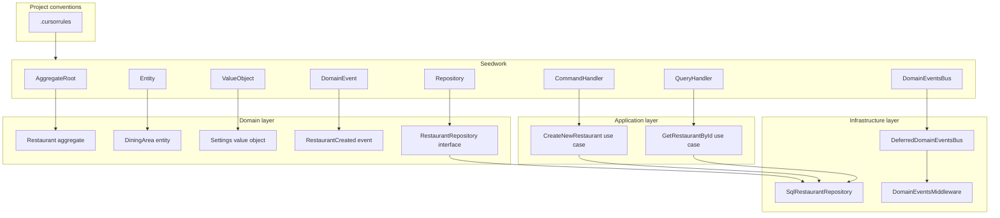

# Seedwork

Seedwork is a small, in-repository library of Domain-Driven Design (DDD) and Hexagonal Architecture building blocks. It provides base classes and interfaces so the application uses consistent patterns—aggregates, entities, value objects, events, repositories, and command/query handlers—without duplicating logic.

## Goal

- **Unify patterns:** All domain and application code extends or implements Seedwork abstractions, keeping the codebase consistent and predictable.
- **Keep the domain pure:** Domain types depend only on Seedwork domain types; no framework or infrastructure in the domain layer.
- **Clear boundaries:** Application use cases are expressed as command handlers (writes) and query handlers (reads), with primitives-only DTOs at the port boundary.

## Architecture role

Seedwork sits between project conventions and application/domain code:



- **Domain layer:** Extends Seedwork domain bases (`AggregateRoot`, `Entity`, `ValueObject`), uses `EntityId`, raises `DomainEvent` and `DomainException`/`ValueException`, and defines repository interfaces extending `Repository<T>`.
- **Application layer:** Use case interfaces extend `CommandHandler<TCommand>` or `QueryHandler<TQuery, TResult>` and declare `execute()`. Handlers implement those interfaces and depend on domain repository interfaces.
- **Infrastructure layer:** Implements `Repository<T>` and optionally `DomainEventsBus` (e.g. `DeferredDomainEventsBus`). Controllers dispatch to use cases; middleware or similar calls `DomainEventsBus::notify()` after handling a request.

## How to use Seedwork

### Domain layer

- **Aggregates:** Extend `Seedwork\Domain\AggregateRoot`. Use a private constructor and static named constructors (`new()`, `build()`). Call `addEvent(DomainEvent)` when something meaningful happens; the event buffer is drained via `getEvents()` (e.g. by repository or middleware) and published to the bus.
- **Entities:** Extend `Seedwork\Domain\Entity`. Readonly, identity via `EntityId`, protected constructor, static `new()`/`build()`.
- **Value objects:** Extend `Seedwork\Domain\ValueObject`. Readonly, immutable, implement `equals(ValueObject)`.
- **Identity:** Use `Seedwork\Domain\EntityId::new()` for new identities and `EntityId::fromString(string)` when loading from storage or commands.
- **Events:** Extend `Seedwork\Domain\DomainEvent`. Readonly, provide `static new(...): self` and pass `type` and `payload`; consumers must not mutate `payload`.
- **Exceptions:** Extend `Seedwork\Domain\Exceptions\DomainException` for domain errors; use `Seedwork\Domain\Exceptions\ValueException` for value object or invariant violations.
- **Repositories:** Define interfaces in the domain extending `Seedwork\Domain\Repository` with `@extends Repository<YourAggregate>`. Declare `save()` and `getById(EntityId)`; add other methods (e.g. `findByUserEmail`) as needed.

### Application layer

- **Command use cases (writes):** Define an interface extending `CommandHandler<YourCommand>` with `execute(YourCommand $command): void`. Implement it in `YourUseCaseHandler`. Commands use only primitive types (no domain types in the DTO).
- **Query use cases (reads):** Define an interface extending `QueryHandler<YourQuery, YourResult>` with `execute(YourQuery $query): YourResult`. Implement it in `YourUseCaseHandler`. Queries use only primitive types.
- Handlers depend on domain repository interfaces (and optionally other application services), not on infrastructure.

### Infrastructure layer

- **Repositories:** Implement the domain repository interface (e.g. `SqlRestaurantRepository`). On save, collect events from the aggregate with `getEvents()` and publish them to `DomainEventsBus::publish()` before or after persisting.
- **Events bus:** Use `Seedwork\Application\DeferredDomainEventsBus` (implements `DomainEventsBus`). Subscribe handlers via `subscribe($eventType, DomainEventHandler)`, where `$eventType` is the event class name (FQCN). Call `notify()` after the request is handled (e.g. in middleware) to deliver all buffered events.

## Concrete examples from this project

### Aggregate and domain event

`Restaurant` extends `AggregateRoot`. When created via `Restaurant::new()`, it adds a `RestaurantCreated` event to its buffer:

```php
// Domain\Restaurants\Entities\Restaurant
$restaurant = new self(/* ... */);
$restaurant->addEvent(RestaurantCreated::new(restaurantId: $restaurant->getId(), restaurant: $restaurant));
return $restaurant;
```

See: `src/Domain/Restaurants/Entities/Restaurant.php`, `src/Domain/Restaurants/Events/RestaurantCreated.php`.

### Command use case

`CreateNewRestaurant` extends `CommandHandler<CreateNewRestaurantCommand>` and declares `execute(CreateNewRestaurantCommand): void`. The handler creates a `Restaurant` and saves it via `RestaurantRepository`:

```php
// Application\Restaurants\CreateNewRestaurant\CreateNewRestaurantHandler
$restaurant = Restaurant::new(email: $command->email);
$this->restaurantRepository->save($restaurant);
```

See: `src/Application/Restaurants/CreateNewRestaurant/CreateNewRestaurant.php`, `src/Application/Restaurants/CreateNewRestaurant/CreateNewRestaurantHandler.php`.

### Query use case

`GetRestaurantById` extends `QueryHandler<GetRestaurantByIdQuery, Restaurant>` and declares `execute(GetRestaurantByIdQuery): Restaurant`. The handler loads the aggregate via the repository (or a domain service) and returns it.

See: `src/Application/Restaurants/GetRestaurantById/GetRestaurantById.php`, `src/Application/Restaurants/GetRestaurantById/GetRestaurantByIdHandler.php`.

### Repository

`RestaurantRepository` extends `Repository<Restaurant>` and adds `findByUserEmail(string): array`. Infrastructure implements it (e.g. `SqlRestaurantRepository`).

See: `src/Domain/Restaurants/Repositories/RestaurantRepository.php`.

### Domain events bus

`DeferredDomainEventsBus` is used in the HTTP stack. After the next middleware handles the request, `DomainEventsMiddleware` calls `$this->domainEventsBus->notify()` so all events published during the request are delivered to subscribed handlers.

See: `src/Infrastructure/Ports/Dashboard/Middlewares/DomainEventsMiddleware.php`, `src/Seedwork/Application/DeferredDomainEventsBus.php`.

## Component reference

Detailed public interfaces and usage for each Seedwork component:

| Document | Components |
|----------|------------|
| [01-domain.md](01-domain.md) | AggregateRoot, Entity, EntityId, ValueObject |
| [02-events-and-exceptions.md](02-events-and-exceptions.md) | DomainEvent, DomainException, ValueException |
| [03-repository.md](03-repository.md) | Repository |
| [04-application.md](04-application.md) | CommandHandler, QueryHandler, DomainEventsBus, DomainEventHandler, DeferredDomainEventsBus |
